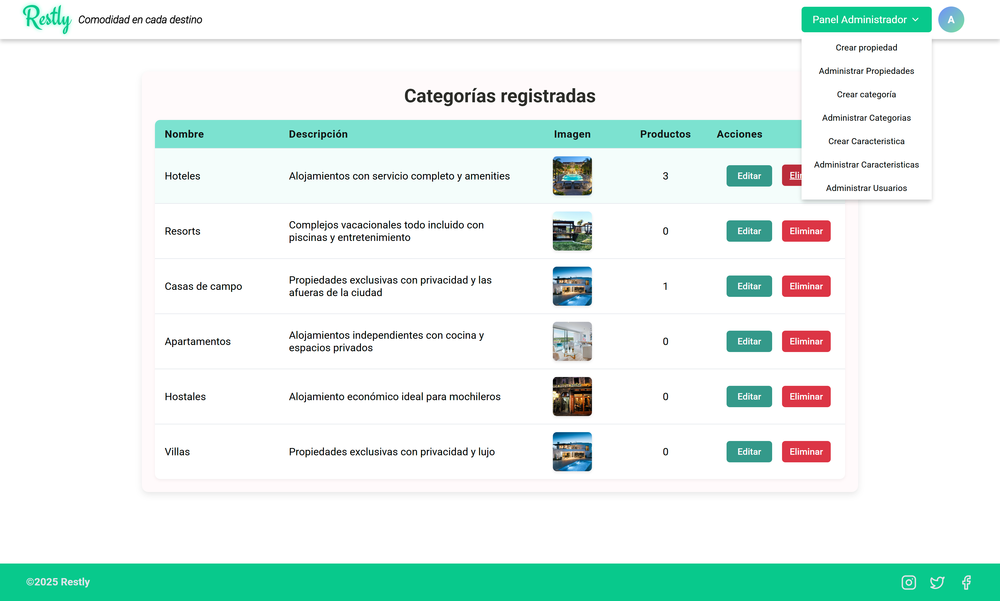
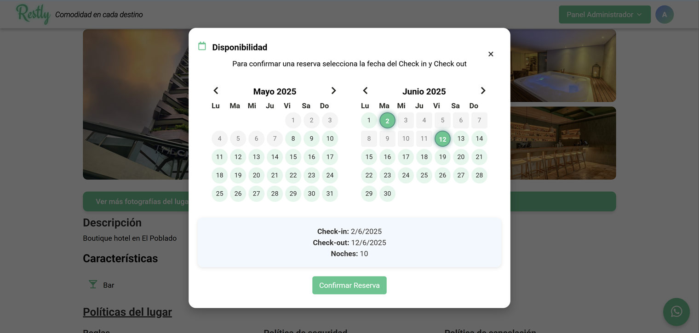
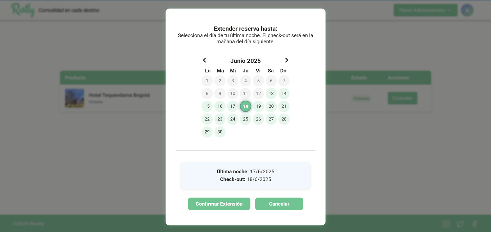
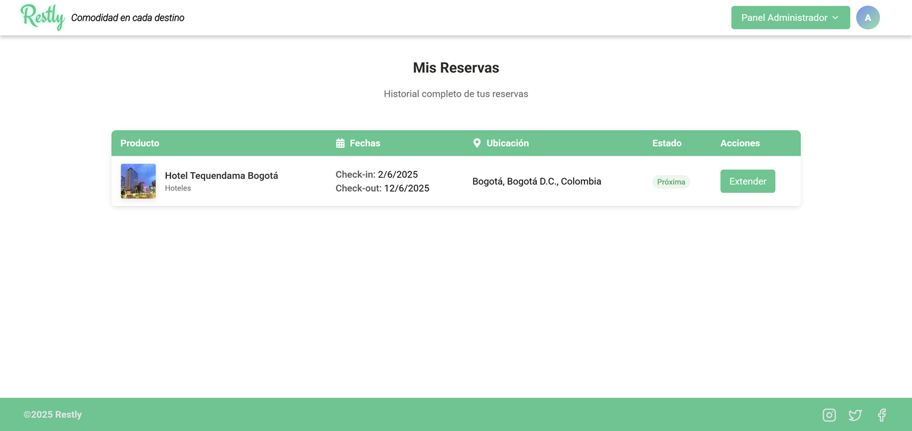
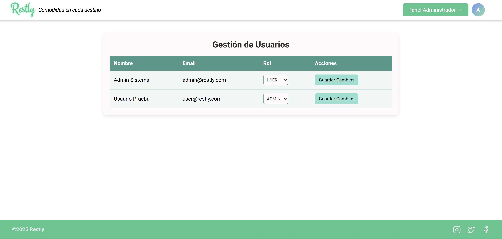
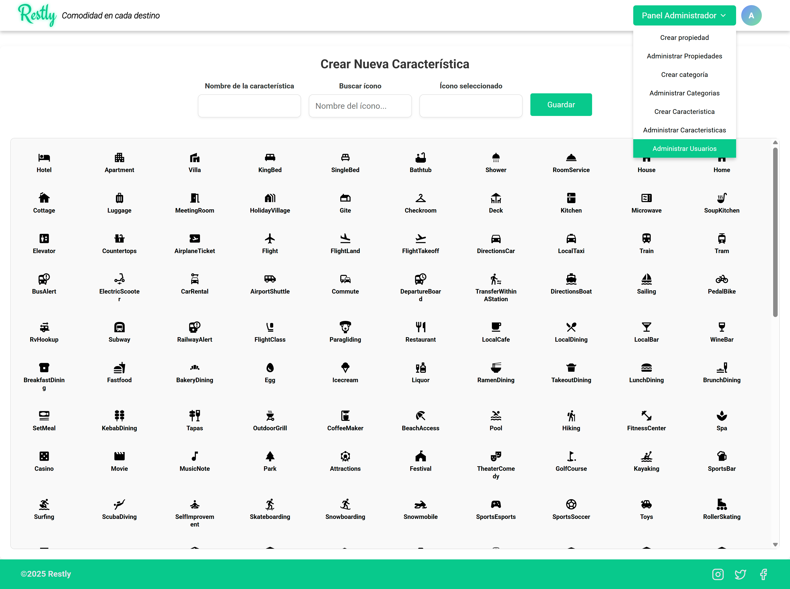

# Restly — Plataforma de Reservas de Alojamientos

**Restly** es una plataforma web diseñada para facilitar la búsqueda, reserva y gestión de alojamientos en línea. Con un enfoque intuitivo y moderno, permite a los usuarios encontrar el lugar ideal para sus viajes personales o de negocios. Está construida con **React (JSX) + Vite** en el frontend y **Spring Boot + MySQL** en el backend. Incluye autenticación, filtrado, reservas, reseñas, favoritos y un completo panel administrativo.

---

## ⚙️ Tecnologías Utilizadas

### 🖥️ Frontend

- React (JSX)
- Vite
- Axios
- Material UI
- SweetAlert2
- CSS puro
- Variables de entorno con `.env`

### 🛠️ Backend

- Java 17
- Spring Boot
- Spring Security (JWT)
- ModelMapper
- MySQL (producción) y H2 (desarrollo)
- Maven
- Lombok

---

## 🔧 Configuración del Backend

### 📌 Base de Datos

Asegúrate de tener MySQL en ejecución y crea la base de datos:

```sql
CREATE DATABASE restly;
```

### 📝 application.properties

Configura tu archivo `application.properties` así:

```properties
spring.application.name=restly_backend
spring.jpa.hibernate.ddl-auto=update
spring.datasource.url=jdbc:mysql://localhost:3306/restly

# 👇 Ajusta estas credenciales según tu entorno
spring.datasource.username=TU_USUARIO_MYSQL
spring.datasource.password=TU_CONTRASEÑA_MYSQL

spring.datasource.driver-class-name=com.mysql.cj.jdbc.Driver
spring.jpa.show-sql=true

# Logging
logging.level.org.springframework.security=DEBUG
logging.level.org.springframework.web=DEBUG

# Configuración del correo
spring.mail.host=smtp.gmail.com
spring.mail.port=587
spring.mail.username=restly.envios@gmail.com
spring.mail.password=vsng gdab htzs ugbn
spring.mail.properties.mail.smtp.auth=true
spring.mail.properties.mail.smtp.starttls.enable=true
spring.mail.from=Restly <no-reply@restly.com>

server.port=8080

```

---

## 🌐 Configuración del Frontend

Puedes hacer cualquiera de las siguientes dos opciones:

1. Crear un archivo `.env` en el directorio `/frontend` con este contenido:
2. O simplemente renombrar el archivo existente `.env.example` a `.env` (ya incluye la configuración necesaria).

```env
VITE_BACKEND_URL=http://localhost:8080
```

Esto asegura que el frontend se comunique correctamente con la API del backend.

---

## 🚀 Inicialización del Proyecto

### 🔙 Backend

```bash
cd backend
./mvnw spring-boot:run
```

### 🖼️ Frontend

```bash
cd frontend
npm install
npm run dev
```

---

## 👤 Usuarios por Defecto

| Rol     | Email              | Contraseña  |
|---------|--------------------|-------------|
| Admin   | admin@restly.com   | Admin1234   |
| Usuario | user@restly.com    | User1234    |

---

## 📁 Estructura del Proyecto

```
restly-project/
│
├── backend/
│   └── src/...
│
├── frontend/
│   ├── src/
│   ├── public/
│   └── .env.example  # renombrar a .env
│
├── assets/
│   └── (capturas de pantalla)
│
└── README.md
```

---

## ✅ Funcionalidades Principales

### 👤 Usuario

- Registro e inicio de sesión con JWT
- Búsqueda y filtrado de productos por ciudad, categoría y características
- Calendario interactivo para seleccionar fechas disponibles
- Creación y extensión de reservas
- Sistema de reseñas con estrellas y comentarios
- Gestión de productos favoritos

### 🛠️ Administrador

- Panel administrativo para gestionar:
  - Productos
  - Categorías
  - Características
  - Usuarios y roles
- Edición y eliminación con confirmaciones vía SweetAlert
- Sistema de roles con acceso seguro

### ✉️ Notificaciones

- Envío de correos automáticos de confirmación de reservas

---

## 📝 Notas Importantes

- La base de datos debe estar corriendo en `localhost`, con usuario `root` y contraseña `1234`. Puedes cambiar estos valores en `application.properties`.
- Si usas Gmail para el SMTP, asegúrate de:
  - Habilitar el acceso a aplicaciones poco seguras o usar una contraseña de aplicación.
  - No compartir credenciales sensibles públicamente.
- El archivo `.env` y las claves sensibles **no deben ser versionadas** en Git.

---

## 📸 Capturas del Proyecto

### 🏠 Página Principal (Home)


### 🔍 Filtros de Búsqueda


### 📄 Detalles del Producto


### 📅 Calendario de Reservas


### ⏱️ Extensión de Reservas


### 📂 Mis Reservas


### 👥 Gestión de Usuarios


### 🛠️ Gestión de Características


---

## 📎 Repositorio

Repositorio oficial del proyecto:

🔗 [https://github.com/JuanColiin/restly-project](https://github.com/JuanColiin/restly-project)

---

## 👨‍💻 Autor

**Juan Diego Peña Ceferino**  
Desarrollador — Java · Spring Boot · React  
📧 Contacto: juandiegopenaceferino@gmail.com
